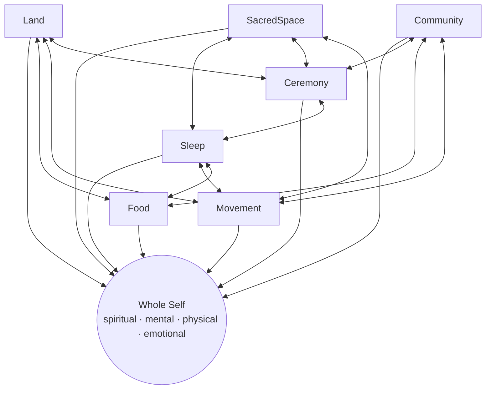

# Deep Research on The Seven Circles: Indigenous Teachings for Living Well

## Executive summary

*The Seven Circles: Indigenous Teachings for Living Well* presents a holistic wellness framework created by entity["people","Chelsey Luger","indigenous wellness educator"] and entity["people","Thosh Collins","indigenous wellness educator"], grounded in Indigenous ancestral knowledge and framed explicitly as a modern, adaptable template for whole-life balance rather than a “diet and exercise” program. The “Seven Circles” are **Food, Movement, Sleep, Ceremony, Sacred Space, Land, and Community**, described as mutually reinforcing domains of relationship that expand/contract over a lifetime rather than discrete tasks to “complete.” citeturn14view1turn12view0turn17view3

Their core thesis is that **well-being is fundamentally relational and interconnected**—spiritual, mental, physical, and emotional health cannot be separated (from one another, from community, or from land). The book argues that many modern wellness paradigms are overly individualistic, commodified, and compartmentalized; the Seven Circles are offered as both a corrective and a bridge: a way for readers (Indigenous and non-Indigenous) to reclaim grounded health practices while avoiding cultural appropriation through careful attention to lineage, consent, and context. citeturn10view0turn12view0turn17view0turn20view0

The book’s strategy is practical and pedagogical: each circle is treated as a “chapter-domain,” and reviews repeatedly note the authors’ “Learn / Engage / Optimize” scaffolding that translates values into daily habits while maintaining a non-perfectionist stance—emphasizing readiness, resilience, and cyclical return to balance. citeturn7view1turn3view0turn9search1turn17view2

From the sources accessible for this report, the strongest primary-text visibility is in publicly licensed excerpts on **Sacred Space** (reprinted in entity["organization","Apartment Therapy","home and lifestyle media site"]) and **Land** (reprinted in entity["organization","Spirituality & Health","magazine and website"]), as well as multiple longform interviews where the authors define circles and state their boundaries around ceremony and appropriation. citeturn3view0turn7view0turn12view0turn17view3

Professional reception is broadly positive: entity["organization","Publishers Weekly","trade magazine publishing"] calls it a “stimulating offering,” highlighting its careful discussion of non-appropriative adoption; entity["organization","Kirkus Reviews","book review magazine"] praises its communal emphasis while noting occasional idealization and clichés; entity["organization","Library Journal","library trade magazine"] underscores its adaptability and the Learn/Engage/Optimize structure. citeturn17view0turn18view3turn7view1 Reader reception (as sampled from major platforms available to this research environment) is also favorable (e.g., StoryGraph average ~4.33/5 from 58 reviews; Google Play audiobook rating 4.7/5 from 3 reviews), with recurring appreciation for accessibility and “decolonizing” framing—and some critiques about specific advice (e.g., calorie-counting references) or preferring print over audio. citeturn11view2turn13view2

A notable rigor point: the book (and readers quoting it) uses the widely circulated statistic that Indigenous peoples are ~5% of the world’s population yet “protect 80% of biodiversity.” This claim is common in high-profile outlets but has also been challenged as not empirically grounded in a single defensible global estimate. This report treats it as (a) a meaningful rhetorical marker of Indigenous stewardship centrality, but (b) a contested statistic that requires careful qualification. citeturn7view0turn22search20turn22news39turn22search4

## Scope, editions, and source base

**Work and edition context.** The book is published by entity["organization","HarperOne","publishing imprint"] (an imprint of entity["company","HarperCollins Publishers","publishing company"]) with an on-sale date of **October 25, 2022**. citeturn14view1turn15view1 Library catalogs list **248 pages** and note **bibliographical references (pages 244–248)**; several retail/trade sources list **256 pages**, so page-count differs across metadata ecosystems. citeturn15view0turn17view0turn14view0

**Audiobook.** The unabridged audiobook is narrated by the authors and is listed around **7 hours 58 minutes** (e.g., OverDrive 07:58:19; Google Play 7 hr 58 min) and is accompanied by a **supplemental enhancement PDF**; some listings also describe “audiobook exclusive exercises.” citeturn1search23turn13view2turn11view0 The audiobook listing visible via entity["company","Audible","audiobook platform"] includes listeners’ remarks about “breathing exercises at the end,” consistent with an exercises component. citeturn11view0

**Source hierarchy used in this report.** Priority was given to: (1) publisher and bibliographic records for structure/metadata; (2) licensed excerpts (Land; Sacred Space) for verbatim text; (3) author interviews/transcripts for definitions and methodological claims; (4) professional reviews for external evaluation; (5) reader-review ecosystems for reception; (6) peer-reviewed and reputable science sources where the book makes testable health claims (e.g., nature exposure and cortisol). citeturn14view1turn15view0turn3view0turn7view0turn12view0turn17view0turn18view3turn11view2turn22search35

image_group{"layout":"carousel","aspect_ratio":"1:1","query":["The Seven Circles Indigenous Teachings for Living Well book cover","Chelsey Luger portrait","Thosh Collins portrait","Well for Culture logo"],"num_per_query":1}

**Citation limits and “unspecified” fields.** This research environment did not provide direct access to the full audiobook waveform/player chapter timestamps, the full print pagination, or the audiobook’s supplemental PDF content. Therefore:
- **Audiobook timestamps for book quotes**: **unspecified** (unless the quote comes from a non-book audio transcript).  
- **Print page numbers for quoted passages**: **unspecified** where excerpts are republished without page mapping.  
This report follows your instruction to label such fields explicitly as **unspecified**.

## Central thesis and how it is argued

**Central thesis (as stated across primary materials).** The authors present an “Indigenous worldview” of wellness as a **balanced, cyclical practice** built from interdependent life domains—Food, Movement, Sleep, Ceremony, Sacred Space, Land, Community—intended to help people “heal,” feel grounded, and live in balance amid a “noisy world.” citeturn14view2turn12view0turn14view1 They position this as both (a) a reclamation of Indigenous wellness narratives beyond deficit framings (health disparities as “incomplete story”), and (b) a critique of mainstream wellness as consumerist, appearance-driven, and youth-centric. citeturn14view2turn10view0turn17view2

**How the thesis is argued (argument architecture).**
- **A model argument**: The circles are intentionally **circular** to resist “pillar/list” thinking and to emphasize that changes in one domain ripple across others; health is “not linear,” and balance is repeatedly regained rather than achieved once-and-for-all. citeturn12view0turn17view3  
- **A cultural/ethical argument**: The authors emphasize Indigenous diversity and explicitly caution that their framework is *an* Indigenous perspective, not *the* Indigenous perspective; they invite learning while setting boundaries around ceremony and appropriation. citeturn12view0turn20view0turn17view0  
- **A practical-method argument**: The repeated **Learn / Engage / Optimize** structure converts reflection into action; professional reviewers cite this structure as a major usability strength. citeturn7view1turn3view0  
- **A lived-example argument**: The authors anchor principles in personal and family practice (e.g., adapting ancestral traditions to modern constraints; technology boundaries; integrating movement into home space). citeturn17view0turn3view0turn10view0  
- **A decolonizing-wellness argument**: In interviews and summaries, they frame “decolonized wellness” as moving away from tribalistic binaries (Paleo vs. vegan; CrossFit vs. yoga), integrating evidence-based science with inherited tradition, and emphasizing relational responsibility (parent/auntie/neighbor/community), not individual optimization. citeturn17view3turn10view0

**Mermaid map of circle relationships (conceptual).** This is a synthesis faithful to the authors’ repeated claim that circles are mutually influential and centered on whole-self balance. citeturn12view0turn17view3

## The seven circles deep dive

What follows is a circle-by-circle analysis that combines (a) the book’s publicly available excerpts (Land; Sacred Space), (b) the authors’ own definitions and boundary-setting in interviews, and (c) reputable contextual scholarship where the authors make empirical claims (e.g., nature exposure and stress physiology). Where **book-page numbers** or **audiobook timestamps** are not verifiable from accessible sources, they are marked **unspecified**.

**Circle: Movement**  
**Definition (authors).** Movement is framed deliberately as broader than “fitness,” emphasizing inclusivity across age, ability, and family structure. citeturn12view0turn20view3  
**Key teachings (interpreted from primary sources).**  
Movement is positioned as (1) a relationship and gratitude practice (not appearance-driven), and (2) a domain that supports mental clarity and emotional regulation. citeturn20view3turn17view3turn12view0  
**Illustrative quote (book page / audiobook timestamp: unspecified).**  
> “We’ve always described it as movement as opposed to just fitness…” citeturn12view0  
A second illustrative quote (from an interview, not the book):  
> “When we run, we’re also giving thanks…[for] legs…[and] a heart…” citeturn20view3  
**Practical applications (book structure).** Reviews describe concrete “incorporate into daily life” suggestions (e.g., walking during calls; placing equipment in living space) as representative of the guidance style. citeturn17view0  
**Indigenous cultural/contextual notes.** Authors repeatedly frame movement as tied to spiritual gratitude (Creator) and to community continuity, not individual performance identity. citeturn20view3turn12view0  
**Suggested exercises & reflection prompts (derived, not quoted).**  
- Choose one “gratitude movement” ritual: before movement, name one bodily function you can appreciate today (breath, legs, balance).  
- Identify an “inclusive movement” option you can do with (or alongside) elders/kids/friends.  
- Weekly reflection: Where did “fitness-as-appearance” thinking show up, and how did it affect motivation?

**Circle: Land**  
**Definition (authors).** Land is defined as intentional reconnection to the natural world—physically (time outdoors) and ethically (care, knowledge, stewardship)—because humans evolved on land and modern indoor/sedentary life drives disconnection. citeturn12view0turn7view0turn17view0  
**Key teachings (from excerpted primary text).** The Land circle is framed as both individual and collective healing: reconnection supports personal well-being *and* shifts worldview toward care amid climate and health crises. citeturn7view0turn17view3  
**Illustrative quotes (book page / audiobook timestamp: unspecified).**  
> “Everything comes from the land.” citeturn7view0  
> “Establishing a connection to the land will not only heal our planet, but it will heal our traumas…” citeturn7view0  
**Practical applications (evidence and alignment).** The excerpt asserts measurable stress benefits from short outdoor exposure and frames reconnection as a conscious corrective to “imposed sedentary, indoor culture.” citeturn7view0 These claims align with peer-reviewed findings that nature exposure of ~20 minutes can reduce cortisol (“nature pill”), and that brief “green exercise” can improve mood and self-esteem. citeturn22search35turn22search1turn22search2  
**Cultural/context notes and a rigor caution.** The excerpt uses the widely circulated claim that Indigenous peoples are ~5% of the world’s population yet protect ~80% of biodiversity. citeturn7view0turn11view2 This statistic appears in prominent advocacy and media contexts, but it has also been publicly challenged as not empirically grounded in a single defensible global estimate; treating it as a definitive quantitative claim is therefore risky. citeturn22search20turn22news39turn22search4 A more defensible formulation (supported across research syntheses) is that Indigenous stewardship is often associated with high biodiversity value and strong conservation outcomes, even if the exact global-percent figure is debated. citeturn22search8turn22search20  
**Suggested exercises & reflection prompts (derived, not quoted).**  
- “20-minute land practice” (3x/week): walk/sit outside without headphones; note one plant, one animal/insect, one sky/weather detail.  
- Learn the names (in English and, if possible, local Indigenous languages) of 3 native plants in your area (avoid harvesting without guidance).  
- Reflection: What indoor habit most disconnects you from land, and what boundary could you trial for 7 days?

**Circle: Community**  
**Definition (authors).** Community is framed as belonging and relational infrastructure that fosters confidence, leadership, and health; the authors link it to human survival/evolution in groups and to Indigenous social structures (e.g., clan systems as one example of structured belonging). citeturn12view0turn20view2  
**Key teachings.** A central move of the Seven Circles model is shifting wellness from a privatized self-project to a communal practice: healing is “not just a journey of one” but of families and networks. citeturn10view0turn18view2turn12view0  
**Illustrative quote (book page / audiobook timestamp: unspecified).**  
> “The circle about community is about recognizing the importance of belonging…” citeturn12view0  
A professional-review paraphrase worth highlighting: Kirkus calls out the book’s “emphasis on communal modes of healing” as its most important genre contribution. citeturn18view2  
**Practical applications.** The model treats community as both a support system and a responsibility set (how you show up as a relative/neighbor/citizen). citeturn17view3turn10view0  
**Cultural/context notes.** The authors explicitly resist presenting Indigenous peoples as a monolith and position community as a circle where practices vary widely by Nation, family, and place. citeturn12view0turn17view0  
**Suggested exercises & reflection prompts (derived, not quoted).**  
- Map your “circle of relations”: list 5 people you rely on and 5 who rely on you; identify one neglected relationship.  
- Design one recurring “micro-ceremony of care” (weekly meal, walk, check-in) that builds predictable belonging.  
- Reflection: When you pursue wellness habits, do they isolate you or connect you?

**Circle: Ceremony**  
**Definition (authors).** Ceremony is presented as a modality of peace, clarity, and silence—*not* as instruction in Indigenous ceremonial protocols. The authors explicitly say they are not teaching Indigenous ceremonies; they are teaching the perspective that quiet, intentional practice heals. citeturn12view0turn20view0  
**Key teachings.** Ceremony (in their framing) is the “meaning layer” that turns routine into reverent relationship—especially in a modern environment saturated with “digital noise.” citeturn11view2turn12view0turn20view0  
**Illustrative quote (book page / audiobook timestamp: unspecified).**  
> “We’re not…teaching people indigenous ceremonies.” citeturn12view0  
**Appropriation boundary notes.** The authors repeatedly argue that protecting sacred practices from “guru-ification” and misappropriation is necessary, while still offering respectful pathways for learning when explicitly invited/appropriate (e.g., attending public cultural events with etiquette guidance). citeturn20view0turn10view0  
**Suggested exercises & reflection prompts (derived, not quoted).**  
- Create a 5-minute daily “silence appointment” (no phone): breathe, sit, or walk slowly—no productivity goal.  
- Choose one routine (making tea, cleaning a table) and set an intention first; notice whether intention changes feeling.  
- Reflection: What practices in your heritage/family history could become your authentic ceremony without borrowing closed traditions?

**Circle: Sacred Space**  
**Definition (authors).** Sacred Space is your home (or any space where you spend significant time) and how environment affects well-being; it includes boundaries, light/air, clutter, and digital ecology. citeturn12view0turn3view0  
**Key teachings (from the republished excerpt).** Sacred Space is built through learning (about minimalism, design, sunlight, plants), engagement (decluttering, setting boundaries, intentional cleaning, caring for plants), and optimization (a felt sense of serenity/safety; spaces for movement; healthier digital relationship). citeturn3view0turn7view1  
**Illustrative quotes (book page / audiobook timestamp: unspecified).**  
> “Dig into the…chains of knowledge that come from your own…heritage…” citeturn3view0  
> “Your space feels serene, peaceful, and safe…” citeturn3view0  
**Practical applications.** The excerpt explicitly links home design/decluttering to movement and sleep (e.g., creating “nooks” to move; removing electronics from the bedroom). citeturn3view0turn12view0  
**Cultural/context notes.** The excerpt includes explicit anti-appropriation guidance: cultivating an authentic spiritual/ritual practice grounded in one’s own lineage is framed as both ethical and “more sustainable.” citeturn3view0turn20view0  
**Suggested exercises & reflection prompts (derived, not quoted).**  
- One-zone reset: choose a single surface/area to declutter; sit in the result for 2 minutes and document the sensation.  
- Light-and-air audit: open windows daily; add one living plant if feasible; note impacts on mood.  
- Reflection: Which digital habit most contaminates your sacred space, and what boundary would feel respectful (not punitive)?

**Circle: Sleep**  
**Definition (authors).** Sleep is framed as a relationship to the night: “nighttime was a sacred time,” tied to recovery and survival knowledge. citeturn12view0turn7view1  
**Key teachings.** Sleep is not presented as a biohack; it is a restoration practice interwoven with sacred space (light, screens), ceremony (quieting/closure), and movement (physical regulation). citeturn12view0turn3view0turn17view3  
**Illustrative quote (book page / audiobook timestamp: unspecified).**  
> “The nighttime was a sacred time.” citeturn12view0  
A related quote surfaced in professional review (not in excerpt): entity["organization","Publishers Weekly","trade magazine publishing"] reports the book includes examples such as limiting social media to embrace rest and live “closer” to ancestral ways. citeturn17view0  
**Suggested exercises & reflection prompts (derived, not quoted).**  
- Create a “night boundary” ritual: 30 minutes before bed, dim lights and remove phone from the bedroom (aligns with Sacred Space excerpt guidance). citeturn3view0  
- Track one variable for 7 days: wake time consistency (not sleep quantity) and correlate with mood/energy.  
- Reflection: What would it mean to treat night as “sacred” rather than leftover time?

**Circle: Food**  
**Definition (authors).** Food is not only nutrients; it includes process and relationship—foodways on the land, with community, tied to spiritual connectedness. citeturn12view0turn17view0turn14view2  
**Key teachings (from interview text).** The authors emphasize gratitude and reverence in acquiring food (hunting/foraging/harvesting) and resist simplistic moral binaries about food systems; they also situate food practices inside broader ecological and relational ethics. citeturn10view0turn17view3turn12view0  
**Illustrative quote (book page / audiobook timestamp: unspecified).**  
> “Not just…nutrient… but…processes of food on the land…[and] spiritual connectedness…” citeturn12view0  
A longer interview passage describes giving thanks and apologizing when taking plant life for nourishment and treating plant and animal life as relationally continuous; this is consistent with the book’s relational framing but is not page-locatable here. citeturn10view0  
**Practical applications.** Trade review notes suggest concrete daily-life integration (e.g., small movement shifts; learning about local flora/fauna; connecting with land through outdoor activity), implying the Food circle similarly emphasizes doable steps rather than idealized purity. citeturn17view0turn17view3  
**Suggested exercises & reflection prompts (derived, not quoted).**  
- “Food story” journal: one meal per day, write where ingredients likely came from (land, labor, water) and what relationships are embedded.  
- Add one land-tethered action weekly: grow one herb, visit a farmer’s market, or learn one seasonal local food practice.  
- Reflection: Which food belief is inherited from diet culture (appearance/shame), and what would a “relationship” framing change?

### Comparative table of the seven circles

This table synthesizes (a) the authors’ circle definitions and (b) the book’s recurring Learn/Engage/Optimize pedagogy (explicit in the Sacred Space excerpt and noted by reviewers). citeturn12view0turn3view0turn7view1turn17view0

| Circle | Core theme (relationship to…) | Typical “Learn / Engage / Optimize” pattern | Likely outcomes when nourished | Common imbalance signals (implied by model) |
|---|---|---|---|---|
| Movement | Body, gratitude, capability | Learn inclusive modalities → Engage daily movement → Optimize movement as meaning, not appearance | Energy, mood regulation, resilience | Sedentariness, shame-driven fitness cycles |
| Land | Place, ecology, worldview | Learn local land histories/nature → Engage time outdoors → Optimize stewardship/attachment | Stress reduction, groundedness, care ethic | Disconnection, indoor isolation, ecological numbness |
| Community | Belonging, kinship | Learn your networks → Engage reciprocal care → Optimize shared responsibility | Social support, identity, purpose | Isolation, over-individualism, burnout |
| Ceremony | Meaning, silence, intention | Learn differentiating appropriation vs. authentic ritual → Engage daily quiet/closure → Optimize sustained sacred rhythm | Clarity, emotional regulation, humility | Constant stimulation, reactivity, “noise” |
| Sacred Space | Home/environment | Learn design/health inputs → Engage declutter/boundaries → Optimize serenity/safety | Calm, better sleep, easier movement | Clutter stress, digital overload, unsafe/unrestful spaces |
| Sleep | Night, recovery | Learn sleep ecology → Engage consistent rhythms → Optimize restorative nights | Cognition, emotional stability, physiological repair | Fatigue, irritability, dysregulation |
| Food | Foodways, gratitude, land-labor | Learn food origins → Engage mindful sourcing/prep → Optimize relationship-based nourishment | Metabolic support, connection, reverence | Diet culture swings, disconnection from sourcing |

## Chapter-by-chapter mapping to the seven circles

Multiple library catalogs provide a consistent contents list for the print edition; this is the most reliable accessible mapping for “chapter-by-chapter” structure in this research environment. citeturn15view0turn15view1

| Book section (as listed in catalogs) | Mapped circle | Notes |
|---|---|---|
| Introduction | Framework entry | Sets up “invitation,” balance model, and worldview context (per interviews and community news coverage). citeturn14view2turn12view0 |
| The seven circles: Movement | Movement | Movement is positioned early and repeatedly contrasted with “fitness.” citeturn12view0turn20view3 |
| Land | Land | Licensed excerpt confirms land/worldview framing and nature-dose claims. citeturn7view0turn22search35 |
| Community | Community | Professional review emphasizes the book’s communal healing contribution. citeturn18view2 |
| Ceremony | Ceremony | Interviews stress they are not teaching Indigenous ceremonial protocols. citeturn12view0turn20view0 |
| Sacred space | Sacred Space | Licensed excerpt shows Learn/Engage/Optimize implementation details. citeturn3view0turn7view1 |
| Sleep | Sleep | Interviews define night as sacred and emphasize recovery. citeturn12view0turn17view0 |
| Food | Food | Interviews frame food beyond nutrients into land/community/spiritual relationship. citeturn12view0turn10view0 |
| Conclusion: Future visioning | Integrative closure | Community news coverage describes “future generations” orientation and balance possibility. citeturn14view2turn17view3 |

## Critical perspectives and reception

**Strengths (supported by professional reviews and primary materials).**  
The most consistent strength across sources is that the authors reframe wellness away from commodified, appearance-first “industry” defaults and toward meaning, relationship, and accessibility. citeturn10view0turn17view2turn17view0 Reviewers highlight: (a) the **clarity and practicality** of the Learn/Engage/Optimize structure, citeturn7view1turn3view0 (b) the **ethical attention** to non-appropriative adoption for non-Native readers, citeturn17view0turn3view0turn20view0 and (c) the **communal orientation** that pushes back against individualistic self-help norms. citeturn18view2turn10view0turn17view3 The visual dimension (photographs) is also repeatedly noted. citeturn14view1turn18view2

**Limitations and tensions (also documented in reviews).**  
A key structural tension is that the framework is explicitly **pan-Indigenous/intertribal**—a strength for accessibility, but a risk for overgeneralization. The authors themselves stress that Indigenous peoples are not a monolith and that this is “our” perspective, not *the* perspective. citeturn12view0turn18view2 Kirkus explicitly flags that some generalizations can feel idealized and that advice can be “marred by clichés.” citeturn18view2 Reader reviews echo smaller-scale tensions: some prefer the physical book to audiobook, and some critique specific advice elements (e.g., calorie-counting affirmations) as potentially inconsistent with anti-diet/fatphobia resistance. citeturn11view2

**Alignment with other Indigenous teachings and scholarship (and where it diverges).**  
The Seven Circles aligns with widely attested Indigenous emphases on **interconnectedness, relational responsibility, and cyclical balance**, and it explicitly gestures toward frameworks like the “medicine wheel” as a symbol of integrated spiritual/mental/physical/emotional dimensions (noting this in public-facing discussions). citeturn12view2turn10view0turn17view3 It also aligns with scholarly critiques of settler-colonial extraction and wellness commodification that divorce self-care from history and community care; for example, a peer-reviewed counseling article on “decolonizing wellness” describes how colonization disrupted Indigenous connections to land/spirituality/foodways, and explicitly references Well for Culture’s Seven Circles as a community-rooted model. citeturn20view2 Where this work diverges from some Indigenous scholarship traditions is genre and audience: it is deliberately written as a **self-help–adjacent manual** for broad readership, which can require abstraction from Nation-specific protocols and may sometimes read as universalizing. citeturn18view2turn14view1

**Reception snapshot (as of Feb 23, 2026 PT, from accessible platforms).**
- **Professional reviews:**  
  - Publishers Weekly: positive review emphasizing “thoughtful discussion” of how non-Native readers can adopt principles without appropriating; concludes “Wisdom abounds.” citeturn17view0  
  - Kirkus Reviews: positive overall; praises communal healing emphasis; notes some idealization/clichés. citeturn18view2  
  - Library Journal: highlights adaptability and the Learn/Engage/Optimize structure; positions it as appealing to mainstream self-help readers. citeturn7view1  
  - Oprah Daily feature: frames the book as “re-sacralizing” wellness and includes a direct author quote about settler colonialism as a root driver of many health challenges. citeturn17view2  
- **Reader ratings (partial, platform-limited):**  
  - StoryGraph: **4.33 average** from **58 reviews** (page displaying aggregate plus review excerpts). citeturn11view2  
  - Google Play Audiobooks: **4.7 stars** from **3 reviews** (with dated reviews). citeturn13view2  
  - Target (hardcover product page): **5/5** based on **1 review** (not a broad sample). citeturn14view0  
  - Some library-community rating pages show mid-to-high 3/5 averages based on small n (library-user populations vary). citeturn16search18  
- **Controversies:** No major public controversy specific to this title surfaced in accessible sources. Instead, the dominant “controversy-adjacent” discourse is broader: Indigenous cultural appropriation in wellness. The authors actively position themselves against appropriation and provide guidance for allies to learn responsibly and support Indigenous-led organizations. citeturn20view0turn3view0turn17view0

## Recommended further reading and primary sources to prioritize

**Primary and near-primary sources for *this* work (highest priority).**
- The book itself (print/eBook) and the unabridged audiobook (including the supplemental enhancement PDF). citeturn15view0turn11view0turn13view2  
- Author interviews that contain direct definitions of each circle and explicit non-appropriation boundaries:  
  - entity["podcast","Humans Outside","outdoor wellness podcast"] (edited transcript includes circle definitions and caveats). citeturn12view0  
  - entity["podcast","Pulling the Thread","podcast by elise loehnen"] episode transcript (deep context on decolonizing wellness, movement/food discussions, appropriation boundaries). citeturn10view0  
  - entity["podcast","The One You Feed","self-improvement podcast"] show notes (useful topical map; seek full audio/transcript externally for precise quotations). citeturn12view2  
  - Experience Life Q&A (explicitly articulates why “circles” vs lists and frames decolonized wellness). citeturn17view3  
- Licensed excerpts for direct textual evidence:  
  - Sacred Space excerpt (Apartment Therapy). citeturn3view0  
  - Land excerpt (Spirituality & Health). citeturn7view0  

**Indigenous-led organizations and primary-source hubs (for ethical learning pathways).**  
These are explicitly recommended by the authors in the context of allyship and appropriation education: entity["organization","NDN Collective","indigenous-led organization"], entity["organization","IllumiNative","indigenous narrative change org"], and entity["organization","Native Wellness Institute","native wellness nonprofit"]. citeturn20view0turn20view2

**Indigenous-authored scholarship and adjacent rigorous works to prioritize (selected, non-exhaustive).**  
The following are widely taught/used works that deepen several circles (Land, Community, Ceremony, Foodways, and decolonizing frameworks). Titles below are recommendations rather than claims of direct influence unless otherwise sourced:
- entity["book","Braiding Sweetgrass","kimmerer 2013"] (entity["people","Robin Wall Kimmerer","potawatomi author"]) — relational ecology and reciprocity (Land/Food/Ceremony).  
- entity["book","Decolonizing Methodologies","linda tuhiwai smith 1999"] (entity["people","Linda Tuhiwai Smith","maori scholar"]) — research/knowledge ethics relevant to appropriation and “who gets to teach what.”  
- entity["book","As We Have Always Done","simpson 2017"] (entity["people","Leanne Betasamosake Simpson","anishinaabe scholar"]) — resurgence, consent, relationality (Community/Ceremony).  
- entity["book","Sand Talk","yunkaporta 2019"] (entity["people","Tyson Yunkaporta","aboriginal australian academic"]) — systems thinking and relational logic supporting “circle” epistemologies.  
- entity["book","As Long as Grass Grows","gilio-whitaker 2019"] (entity["people","Dina Gilio-Whitaker","indigenous scholar"]) — land, environmental justice, sovereignty (Land/Community).  
- entity["book","Research Is Ceremony","shawn wilson 2008"] (entity["people","Shawn Wilson","cree scholar"]) — relational accountability, aligning strongly with Ceremony/Community.  
- For a peer-reviewed framing of “decolonizing wellness” that explicitly references the Seven Circles approach in counseling contexts: citeturn20view2  

**Contextual science references (useful for the book’s Land/Movement claims).**  
- Nature exposure and stress physiology: entity["organization","Frontiers in Psychology","peer-reviewed journal"] study and reputable summaries support cortisol reductions around ~20 minutes of nature exposure. citeturn22search35turn22search1  
- “Green exercise” and mood/self-esteem: a meta-analysis indicates mental health benefits with short-duration green exercise, often peaking early. citeturn22search2turn22search10  
- Vitamin D and sun exposure context (if using sunlight as part of Land/Sacred Space practice): NIH Office of Dietary Supplements fact sheet gives authoritative background. citeturn22search23